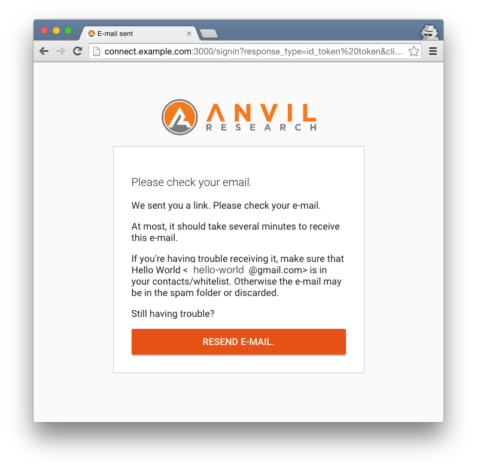
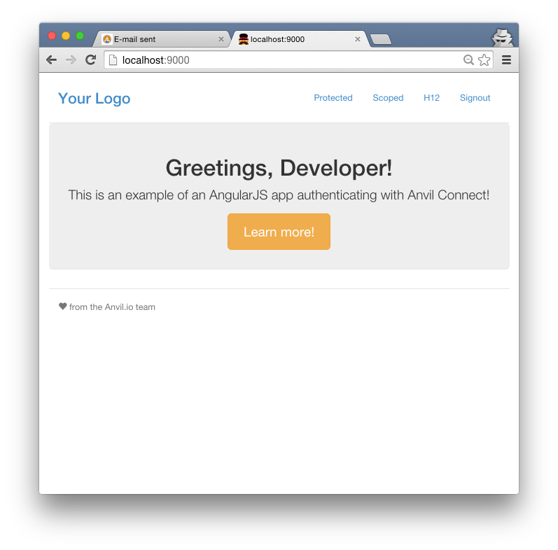

# Email only sign in and sign up

When a connect server is configured to support `passwordless` sign-in users can login with their email address. This is akin to password reset flows where typically a reset link is send to the email address on file for a user account.

This feature is experimental and inspired by medium who introduced an [email login](https://medium.com/the-story/signing-in-to-medium-by-email-aacc21134fcd).

## Email only sign in

With `passwordless` enabled you can choose to *Sign in or create an account with your email* on the sign in page, as shown below:

You simply enter your email and submit with the *SIGN IN* button.
As a result the page will tell you that you should check your email:

In most cases this email arrives within a minute:

When you follow the link you will get signed in:

Notice that the page above show the *Signout* link and to its left your name *H12*. Presumably you will have a nicer name than what was used in this test.

These screenshots come from the [angular example](https://github.com/anvilresearch/connect-example-angularjs).

## Email only sign up

As mentioned above the email only sign up starts out exactly like
a sign in. After selecting to *Sign in or create an account with your email* on the sign in page and then providing your email you will see the same page telling you to check your email. This page is intentionally identical to the sign in page so that an attacker cannot easily check on whether there is an account already for an email.

Indeed assuming you have control over your email you will receive that attacker initiated email which allows you to be vigilant.

However if the connect server determines that there is not yet an account for a given email, the email sent allows you to create an account instead of signing in:

When the link is activated you will get a form where you can enter additional user information. By default your family and given name can be entered.

Once this form is submitted with the *SIGN UP* button a user is created and signed in.
